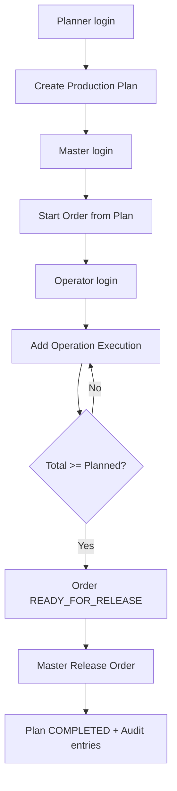

# MVP Backend (Вариант 5): «Производство — планирование → производство»

## 1) Краткое описание архитектуры
- Монолит на Spring Boot 3 (Java 17), слоистая архитектура: `controller / service / repository / entity / dto / security / audit / exception`.
- Аутентификация: `POST /api/auth/login` (username/password), JWT access token с TTL 15 минут.
- Авторизация: RBAC + object-level проверки в service-слое.
- Данные: PostgreSQL + Flyway миграции.
- Аудит: таблица `audit_log` и сервис аудита для критичных действий.
- Безопасность: bcrypt-хеши паролей, нейтральные ошибки, валидация DTO, запрет неожиданных полей JSON, отсутствие хардкода секретов.

## 2) Структура проекта
```text
assignment3
├── pom.xml
├── build.gradle
├── Dockerfile
├── docker-compose.yml
├── docker/postgres/init/01_create_app_user.sql
├── src/main/java/com/example/mvp
│   ├── ProductionMvpApplication.java
│   ├── audit/AuditService.java
│   ├── controller/{AuthController,PlanController,OrderController}.java
│   ├── dto/{auth,error,order,plan}/*
│   ├── entity/{UserEntity,ProductionPlan,ProductionOrder,OperationExecution,AuditLog,Role,PlanStatus,OrderStatus}.java
│   ├── exception/*
│   ├── repository/*
│   ├── security/*
│   └── service/*
└── src/main/resources
    ├── application.yml
    └── db/migration/{V1__init_schema.sql,V2__seed_data.sql}
```

## 3) Полный список зависимостей Maven (pom.xml)
См. файл: [pom.xml](/Users/rauka/IdeaProjects/assignment3/pom.xml)

Ключевые:
- `spring-boot-starter-web`
- `spring-boot-starter-security`
- `spring-boot-starter-data-jpa`
- `spring-boot-starter-validation`
- `flyway-core`, `flyway-database-postgresql`
- `postgresql`
- `jjwt-api`, `jjwt-impl`, `jjwt-jackson`
- `lombok`
- `spring-boot-starter-test`, `spring-security-test`

## 4) application.yml
См. файл: [application.yml](/Users/rauka/IdeaProjects/assignment3/src/main/resources/application.yml)

## 5) docker-compose.yml (PostgreSQL)
См. файл: [docker-compose.yml](/Users/rauka/IdeaProjects/assignment3/docker-compose.yml)

Пользователь приложения создается без superuser:
- [01_create_app_user.sql](/Users/rauka/IdeaProjects/assignment3/docker/postgres/init/01_create_app_user.sql)

## 6) Flyway миграции SQL
- [V1__init_schema.sql](/Users/rauka/IdeaProjects/assignment3/src/main/resources/db/migration/V1__init_schema.sql)
- [V2__seed_data.sql](/Users/rauka/IdeaProjects/assignment3/src/main/resources/db/migration/V2__seed_data.sql)

## 7) Основные Java-классы по файлам
Main:
- [ProductionMvpApplication.java](/Users/rauka/IdeaProjects/assignment3/src/main/java/com/example/mvp/ProductionMvpApplication.java)

Entities:
- [entity](/Users/rauka/IdeaProjects/assignment3/src/main/java/com/example/mvp/entity)

Repositories:
- [repository](/Users/rauka/IdeaProjects/assignment3/src/main/java/com/example/mvp/repository)

DTO:
- [dto](/Users/rauka/IdeaProjects/assignment3/src/main/java/com/example/mvp/dto)

Controllers:
- [AuthController.java](/Users/rauka/IdeaProjects/assignment3/src/main/java/com/example/mvp/controller/AuthController.java)
- [PlanController.java](/Users/rauka/IdeaProjects/assignment3/src/main/java/com/example/mvp/controller/PlanController.java)
- [OrderController.java](/Users/rauka/IdeaProjects/assignment3/src/main/java/com/example/mvp/controller/OrderController.java)

Services:
- [AuthService.java](/Users/rauka/IdeaProjects/assignment3/src/main/java/com/example/mvp/service/AuthService.java)
- [PlanService.java](/Users/rauka/IdeaProjects/assignment3/src/main/java/com/example/mvp/service/PlanService.java)
- [OrderService.java](/Users/rauka/IdeaProjects/assignment3/src/main/java/com/example/mvp/service/OrderService.java)

Security:
- [SecurityConfig.java](/Users/rauka/IdeaProjects/assignment3/src/main/java/com/example/mvp/security/SecurityConfig.java)
- [JwtService.java](/Users/rauka/IdeaProjects/assignment3/src/main/java/com/example/mvp/security/JwtService.java)
- [JwtAuthenticationFilter.java](/Users/rauka/IdeaProjects/assignment3/src/main/java/com/example/mvp/security/JwtAuthenticationFilter.java)
- [CustomUserDetailsService.java](/Users/rauka/IdeaProjects/assignment3/src/main/java/com/example/mvp/security/CustomUserDetailsService.java)

Audit:
- [AuditService.java](/Users/rauka/IdeaProjects/assignment3/src/main/java/com/example/mvp/audit/AuditService.java)

Exceptions:
- [GlobalExceptionHandler.java](/Users/rauka/IdeaProjects/assignment3/src/main/java/com/example/mvp/exception/GlobalExceptionHandler.java)

## 8) Enum’ы статусов и ролей
- [Role.java](/Users/rauka/IdeaProjects/assignment3/src/main/java/com/example/mvp/entity/Role.java): `PLANNER, MASTER, OPERATOR`
- [PlanStatus.java](/Users/rauka/IdeaProjects/assignment3/src/main/java/com/example/mvp/entity/PlanStatus.java): `DRAFT, APPROVED, IN_PROGRESS, COMPLETED, CANCELLED`
- [OrderStatus.java](/Users/rauka/IdeaProjects/assignment3/src/main/java/com/example/mvp/entity/OrderStatus.java): `CREATED, STARTED, OPERATIONS_IN_PROGRESS, READY_FOR_RELEASE, RELEASED`

## 9) Seed/test data
- SQL seed: [V2__seed_data.sql](/Users/rauka/IdeaProjects/assignment3/src/main/resources/db/migration/V2__seed_data.sql)
- Тестовые пользователи:
  - `planner1 / password`
  - `master1 / password`
  - `operator1 / password`

## 10) curl полного сценария
```bash
# 0) login planner
PLANNER_TOKEN=$(curl -s -X POST http://localhost:8080/api/auth/login \
  -H "Content-Type: application/json" \
  -d '{"username":"planner1","password":"password"}' | jq -r '.accessToken')

# 1) planner creates plan
PLAN_ID=$(curl -s -X POST http://localhost:8080/api/plans \
  -H "Authorization: Bearer $PLANNER_TOKEN" \
  -H "Content-Type: application/json" \
  -d '{
    "productCode":"PUMP_001",
    "productName":"Pump A",
    "plannedQuantity":100,
    "plannedDate":"2026-04-12"
  }' | jq -r '.id')

# 2) login master
MASTER_TOKEN=$(curl -s -X POST http://localhost:8080/api/auth/login \
  -H "Content-Type: application/json" \
  -d '{"username":"master1","password":"password"}' | jq -r '.accessToken')

# 3) master starts order
ORDER_ID=$(curl -s -X POST http://localhost:8080/api/orders/$PLAN_ID/start \
  -H "Authorization: Bearer $MASTER_TOKEN" | jq -r '.id')

# 4) login operator
OPERATOR_TOKEN=$(curl -s -X POST http://localhost:8080/api/auth/login \
  -H "Content-Type: application/json" \
  -d '{"username":"operator1","password":"password"}' | jq -r '.accessToken')

# 5) operator marks operation done
curl -s -X POST http://localhost:8080/api/orders/$ORDER_ID/operations \
  -H "Authorization: Bearer $OPERATOR_TOKEN" \
  -H "Content-Type: application/json" \
  -d '{"operationName":"Cutting","completedQuantity":100}'

# 6) master releases batch
curl -s -X POST http://localhost:8080/api/orders/$ORDER_ID/release \
  -H "Authorization: Bearer $MASTER_TOKEN"
```

## 11) Какие уязвимости предотвращены в MVP и как именно
| Уязвимость | Где могла возникнуть | Как предотвращена |
|---|---|---|
| Broken Access Control | Изменение/запуск/выпуск чужих сущностей | `@PreAuthorize` + проверки ролей и состояния объектов в service |
| IDOR | Доступ оператора к неподходящим заказам | Object-level checks в `OrderService#getOrder/getOrders/addOperation` |
| SQL Injection | Любой поиск/запись в БД | Только Spring Data JPA/JPQL с параметрами, без SQL-конкатенации |
| Sensitive Data Exposure | Логи, ответы об ошибках | Нейтральные ошибки + без вывода токенов/паролей/секретов |
| Weak Password Storage | Хранение user credentials | BCrypt hash в таблице `app_user.password_hash` |
| JWT misuse | Долгоживущие токены | Короткий TTL (`900s`), stateless auth filter |
| Mass Assignment/Unexpected Fields | DTO десериализация | `fail-on-unknown-properties=true` + строгие DTO |
| Input Validation gaps | quantity/code/operationName | `jakarta.validation` (`@Min/@Max/@Pattern/@Size`) |
| Privileged DB account | Подключение app к БД | Отдельная роль `prod_app` с `NOSUPERUSER` |

## 12) Что показать в отчете по заданию 1 и 2
- Threat model (коротко): активы (`plans/orders/audit/users`), роли, trust boundaries (`API`, `DB`).
- Демонстрация RBAC: planner/master/operator получают разные 200/403 на одни и те же URL.
- Демонстрация object-level control: редактирование плана после старта дает `409`.
- Демонстрация audit trail: записи в `audit_log` для create/update/start/operation/release.
- Демонстрация neutral errors: 400/401/403/404/409 без stacktrace.
- Конфигурация секретов через env vars, отсутствие hardcoded credentials.

## 13) Дополнительно
### 13.1 Структурная схема MVP (текст)
`Client -> REST Controllers -> Services (RBAC + business checks + audit) -> Repositories -> PostgreSQL`

### 13.2 Блок-схема основного сценария (Mermaid)


### 13.3 Source → propagation → sink → sanitization (пример)
- Source: JSON `POST /api/orders/{id}/operations` (`operationName`, `completedQuantity`).
- Propagation: `OrderController -> OrderService.addOperation`.
- Sink: `operation_execution` insert через JPA repository.
- Sanitization/controls: Bean Validation + role/state checks + JPA parameterization (no raw SQL).

### 13.4 Таблица находок и рекомендаций (как будто часть уже исправлена)
| Finding | Риск | Статус | Что сделано / рекомендация |
|---|---|---|---|
| Нет refresh token | Средний UX-риск | Принято для MVP | Оставлено intentionally, т.к. требуется минимум |
| JWT secret default в `application.yml` | Средний | Исправлено частично | Для прод: обязательный env `JWT_SECRET`, без default |
| Локально не поднят Docker daemon | Низкий (infra) | Не исправлено в коде | Включить Docker Desktop перед `docker compose up -d` |
| Нет assignment оператора к заказу | Средний (fine-grained ACL) | Принято для MVP | В v2 добавить таблицу назначения `order_operator` |

## Проверки и запуск
```bash
# 1) Поднять PostgreSQL (Docker)
docker compose up -d

# 2) Запустить приложение локально (Maven/Gradle)
mvn spring-boot:run
# или
./gradlew bootRun

# 3) Сборка классов (уже проверено в этом окружении)
./gradlew classes

# 4) SCA/SAST
mvn org.owasp:dependency-check-maven:check
mvn spotbugs:check
# Sonar/Semgrep - по CI профилю проекта
```
